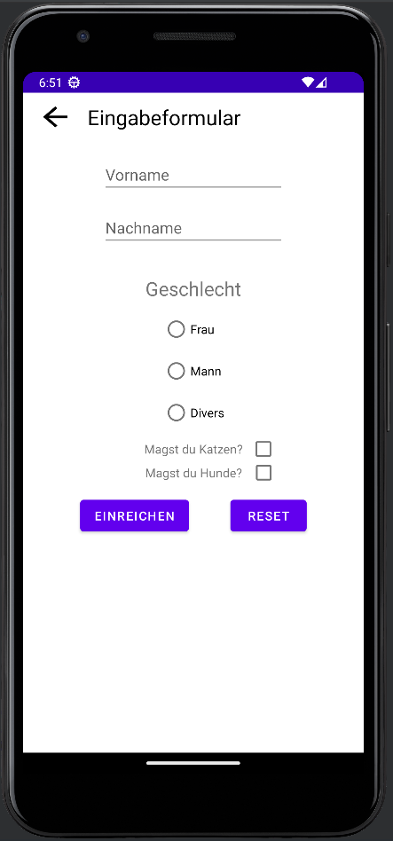

# Praxisaufgabe - Eingabeformular für Tierliebhaber

Willkommen zur wöchentlichen Praxisaufgabe, heute wirst du ein Eingabeformular erstellen.

---

### Auftrag
Die Firma "PetConnect" sucht nach der Entwicklung einer Android-App, die ein Eingabeformular bereitstellt. 
Das Formular soll Informationen über potenzielle Kunden sammeln, insbesondere deren Vorname, Nachname, Geschlecht sowie Vorlieben bezüglich Katzen und Hunden.
Die Benutzeroberfläche soll der in Abbildung 1 dargestellten ähneln. Sie muss jedoch nicht exakt gleich aussehen.

Zusätzlich hat deine Benutzeroberfläche folgende Funktionalitäten:
1. Der Nutzer kann einen Vornamen und einen Nachnamen in die Textfelder "Vorname" 
und "Nachname" eingeben.
2. Der Nutzer kann ein Geschlecht auswählt. Es kann immer nur ein Geschlecht gleichzeitig ausgewählt sein.
3. Der Nutzer kann - muss aber nicht - für die Fragen "Magst du Katzen?" und "Magst du Hunde?" jeweils einen Tick setzen.
4. Wenn der Nutzer auf den Button "Reset" drückt, werden alle Eingaben auf die Standardwerte zurückgestellt.
5. Wenn der Nutzer auf den Button "Einreichen" drückt, wird überprüft, ob der Nutzer alle notwendigen Eingaben (Vorname, Nachname, Geschlecht) 
   ausgefüllt hat. 
   1. Ist das der Fall, wird dem Nutzer eine Bestätigungsnachricht angezeigt, 
   die alle Eingaben noch einmal auflistet. Es wird auch aufgelistet, ob der Nutzer Hunde oder Katzen mag.
   2. Ist das <b>nicht</b> der Fall, wird der Nutzer darauf hingewiesen, dass die Eingaben unvollständig sind.

#### Zusätzlich:  
- Gestalte das Eingabeformular möglichst benutzerfreundlich.  
- Deine App sollte Fehlerfrei funktionieren.
- Wenn möglich, benutze String-Ressourcen.

    Abbildung 1: Eingabeformular

    

